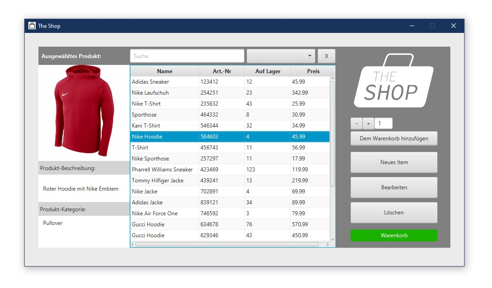
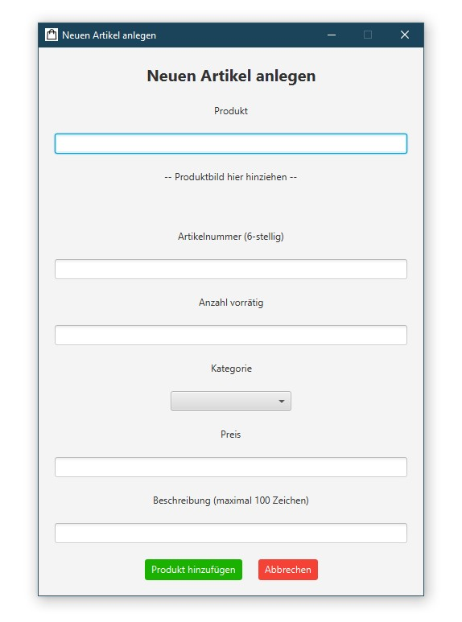
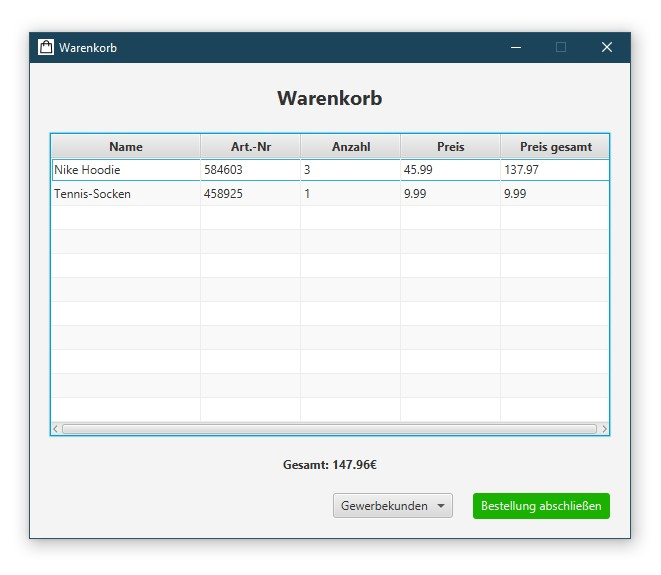

# Warehouse and Retail Manager

During the second semester at the Stuttgart Media University, we were encouraged to work on a project together in a group. In our case it was a warehouse and retail management app.

The warehouse manager includes the display and management of articles with the functions of creating, editing, deleting and also selling articles.

## Screenshots
  

  

  

